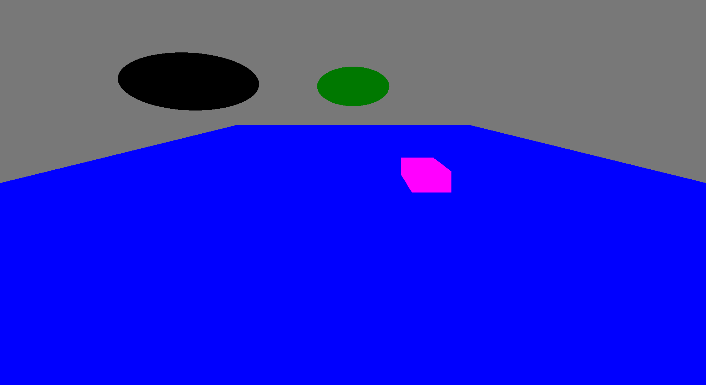

# raytrace
Copyright (c) Katelyn Rule and Sam Shippey

Simple raytracer written in Rust using nalgebra, ncollide3d, and image.

Currently can cast rays and render simple geometric objects in 3d space.

This project is a learning experience -- The authors aren't particularly
experienced in computer graphics.

The project is commented heavily with the long term goal of being a simple, 
featureful, well-documented, and easy to read example of a raytracer with
relatively few dependencies. All the dependencies we pull in are related to
either doing linear algebra (which makes the code more readable) or writing
to images quickly and behind a layer of abstraction. Hopefully this makes
it just a bit easier for someone somewhere to understand raytracing and not 
need to cobble the idea together from Wikipedia pages and YouTube lectures.

# Sample -- What currently works
We've made it to about 1978, just before Turner Whitted figured out shadows.

## License
This project is licensed under the MIT license. See `LICENSE` for more information.
